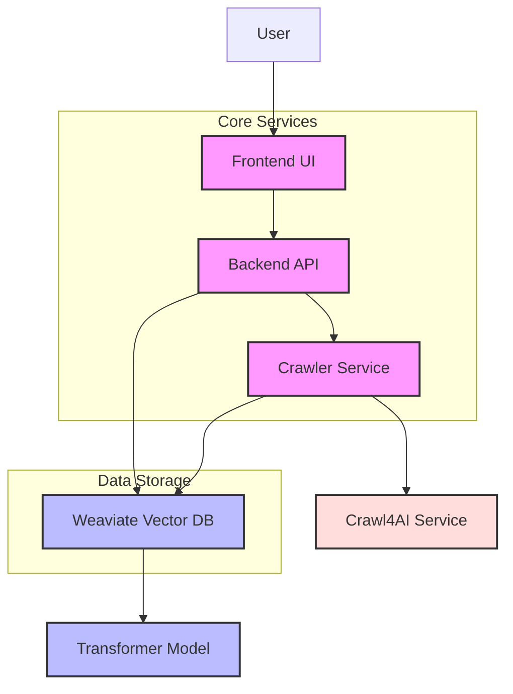
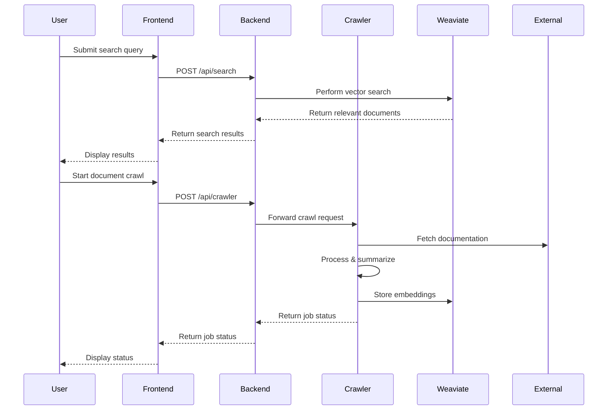
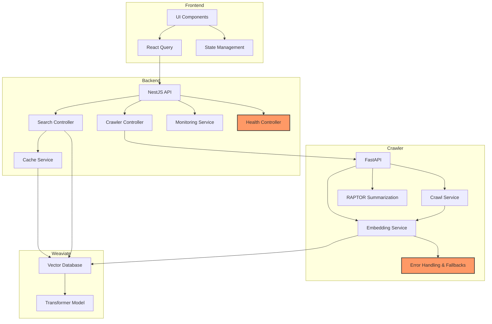
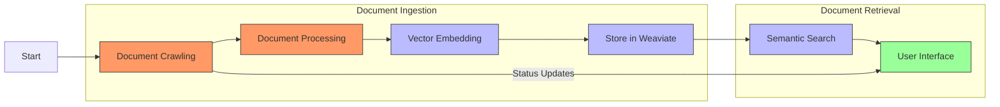

# 🚀 RAPTOR Documentation Assistant

<p align="center">
  
  
  
  
  
  
</p>

A cloud-based documentation assistant using RAPTOR (Recursive Abstractive Processing and Thematic Organization for Retrieval) and Crawl4AI. Transform large-scale documentation into queryable, context-aware knowledge.

## 📖 Overview

RAPTOR Documentation Assistant transforms technical documentation into queryable embeddings for efficient and context-aware programming solutions. It combines advanced crawling capabilities with hierarchical AI-driven summarization to provide precise, up-to-date answers to technical queries.

The system has been thoroughly tested with a comprehensive integration test suite, ensuring reliable communication between all services. The core functionality is now fully operational, supporting the complete workflow from document ingestion to semantic search.

## 🏗 Architecture





The system consists of three fully-integrated microservices:

### 1. 🐍 Crawler Service (Python/FastAPI)

Responsible for fetching and processing documentation:

- **Web Crawling**: Integration with Crawl4AI for efficient web scraping
- **Text Processing**: Extracts key information from HTML
- **Summarization**: RAPTOR-based hierarchical summarization
- **Vector Embedding**: Generates embeddings for vector search

**Key Technologies:**
- FastAPI framework
- Python 3.12
- Asyncio for concurrent processing
- Pydantic for data validation
- Weaviate client for vector storage

### 2. 🖥️ Backend Service (NestJS)

Provides an API layer for the frontend:

- **Search API**: Vector similarity search via Weaviate
- **Crawl Management**: Coordinates crawling operations
- **Caching**: Optimizes frequent queries
- **Monitoring**: Tracks API performance

**Key Technologies:**
- NestJS framework
- TypeScript
- Weaviate client for vector queries
- Class-validator for DTO validation
- Cache Manager for response caching

### 3. 🌐 Frontend (Next.js)

The user interface for interacting with the system:

- **Search Interface**: Query documentation and view results
- **Crawl Management**: Start and monitor crawl jobs
- **Result Visualization**: Display relevant documents with context

**Key Technologies:**
- Next.js 14
- React 18
- TypeScript
- Tailwind CSS
- React Query
- Zustand state management

## 🛠 Technology Stack

### Core Technologies

| Component | Technologies |
|-----------|--------------|
| **Backend** | NestJS, TypeScript, Axios, Cache Manager |
| **Frontend** | Next.js, React, TanStack Query, Tailwind CSS |
| **Crawler** | Python 3.12, FastAPI, HTTPX, BeautifulSoup4 |
| **Vector Store** | Weaviate, Transformer Models |
| **Infrastructure** | Docker, Docker Compose |
| **Testing** | Jest, Pytest, Supertest |

### Component Architecture



### API Endpoints Structure

```mermaid
graph TD
    subgraph "Backend API Endpoints"
        health["/health"]
        apiSearch["/api/search"]
        apiSearchHealth["/api/search/health"]
        apiSearchSimilar["/api/search/similar"]
        apiSearchById["/api/search/:id"]
        apiCrawler["/api/crawler"]
        apiCrawlerCrawl["/api/crawler/crawl"]
        apiCrawlerStatus["/api/crawler/status/:jobId"]
        apiCrawlerById["/api/crawler/:jobId"]
        apiCrawler4ai["/api/crawler/crawl4ai-docs"]
    end
    
    subgraph "Crawler API Endpoints"
        crawlerHealth["/health"]
        crawlerApiDocs["/docs"]
        crawlerApiV1Crawl["/api/v1/crawl"]
        crawlerApiV1CrawlJob["/api/v1/crawl/{job_id}"]
        crawlerApiV1Crawl4ai["/api/v1/crawl/crawl4ai-docs"]
        crawlerApiV1Embedding["/api/v1/embeddings"]
        crawlerApiV1EmbeddingSearch["/api/v1/embeddings/search"]
        crawlerApiV1Summary["/api/v1/summary"]
    end
    
    apiCrawler --> crawlerApiV1Crawl
    apiCrawlerCrawl --> crawlerApiV1Crawl
    apiCrawlerById --> crawlerApiV1CrawlJob
    apiCrawlerStatus --> crawlerApiV1CrawlJob
    apiCrawler4ai --> crawlerApiV1Crawl4ai
    
    apiSearch --> crawlerApiV1EmbeddingSearch
    apiSearchSimilar --> crawlerApiV1EmbeddingSearch
    
    classDef health fill:#9f9,stroke:#333
    classDef search fill:#bbf,stroke:#333
    classDef crawler fill:#f9f,stroke:#333
    
    class health,crawlerHealth health
    class apiSearch,apiSearchSimilar,apiSearchById,apiSearchHealth,crawlerApiV1EmbeddingSearch,crawlerApiV1Embedding search
    class apiCrawler,apiCrawlerCrawl,apiCrawlerStatus,apiCrawlerById,apiCrawler4ai,crawlerApiV1Crawl,crawlerApiV1CrawlJob,crawlerApiV1Crawl4ai,crawlerApiV1Summary crawler
```



## 🚦 Getting Started

### Prerequisites

- Node.js >= 20
- Python >= 3.12
- Docker & Docker Compose
- pnpm (for Node.js package management)
- Poetry (for Python package management)

### Quick Start with Docker

The fastest way to get started is using Docker Compose and our demo script:

```bash
# Clone the repository
git clone https://github.com/JtPerez-Acle/RaptorDocu
cd raptor-docu

# Start all services with Docker Compose
docker-compose up -d

# Run the demo workflow script
./scripts/workflow-demo.sh
```

The demo script will:
1. Verify all services are running correctly
2. Add sample documents to the vector database
3. Perform test queries to demonstrate search functionality
4. Test the backend API integration
5. Guide you through the next steps

You can then access the full system:
- Frontend: http://localhost:8000
- Backend API & Swagger: http://localhost:3000/api
- Backend Health: http://localhost:3000/health
- Crawler API & Swagger: http://localhost:8080/docs
- Crawler Health: http://localhost:8080/health
- Weaviate Console: http://localhost:8081/v1/console

#### System Health Verification

Our system includes comprehensive health checks for all services. You can verify the system status with:

```bash
# Check backend service health
curl http://localhost:3000/health

# Check crawler service health
curl http://localhost:8080/health

# Check Weaviate ready status
curl http://localhost:8081/.well-known/ready

# Run all tests
cd scripts && python3 tests/run_all_tests.py
```

### Manual Setup

#### 1. Backend (NestJS)

```bash
cd backend
pnpm install
cp .env.example .env  # Configure environment variables
pnpm run dev  # Starts on http://localhost:3000
```

#### 2. Frontend (Next.js)

```bash
cd frontend
pnpm install
cp .env.example .env  # Configure environment variables
pnpm run dev  # Starts on http://localhost:8000
```

#### 3. Crawler Service (Python/FastAPI)

```bash
cd crawler
poetry install
cp .env.example .env  # Configure environment variables
poetry run python -m src.app  # Starts on http://localhost:8080
```

## 🧪 Testing

We follow Test-Driven Development practices with comprehensive test suites:

```bash
# Backend tests
cd backend
pnpm run test        # Unit tests
pnpm run test:e2e    # End-to-end tests

# Frontend tests
cd frontend
pnpm run test        # Component and integration tests

# Crawler tests
cd crawler
poetry run pytest    # Unit and integration tests
```

## 🛠️ CLI Tools

For command-line interaction with the API:

```bash
cd backend/scripts
./raptor-cli.sh help        # Show available commands
./raptor-cli.sh search      # Search documentation
./raptor-cli.sh crawl       # Start a crawl job
./raptor-cli.sh monitoring  # Check API performance
```

## 📚 Documentation

Detailed documentation is available in the `docs/` directory:

- [Project Plan](docs/PROJECT_PLAN.md): Development roadmap and progress
- [API Endpoints](docs/API_ENDPOINTS.md): Complete API reference
- [Changelog](docs/CHANGELOG.md): Version history and updates
- [Architecture](docs/structure/structure.md): Detailed architecture guide
- [Demo Guide](docs/DEMO.md): Step-by-step guide to running demonstrations
- [Workflow Test Summary](docs/WORKFLOW_TEST_SUMMARY.md): Results from system integration testing
- [API Fixes Summary](docs/API_FIXES_SUMMARY.md): Details of recent API improvements

## 🔄 System Workflow



## 🔍 Key Features

- **Recursive Summarization**: Hierarchical document understanding
- **Semantic Search**: Context-aware vector search
- **Automated Crawling**: Efficient documentation extraction
- **Performance Monitoring**: Real-time API metrics
- **Error Resilience**: Graceful fallbacks for service interruptions
- **Caching**: Optimized response times for frequent queries
- **Health Monitoring**: Comprehensive health checks for all services

## 🛠️ Recent Improvements

- **Enhanced API Structure**: Consistent endpoint patterns with proper prefixing
- **Improved Error Handling**: Robust error capture and graceful recovery
- **Cross-Service Integration**: Reliable communication between all services
- **Standardized Responses**: Consistent response formats across all endpoints
- **Health Endpoints**: Dedicated health checks for all services
- **Fallback Mechanisms**: Mock data generation for service unavailability

## 📄 License

This project is licensed under the MIT License - see the [LICENSE](LICENSE) file for details.

## 👥 Team

- Jose Tomas Perez-Acle - Project Lead & Main Engineer