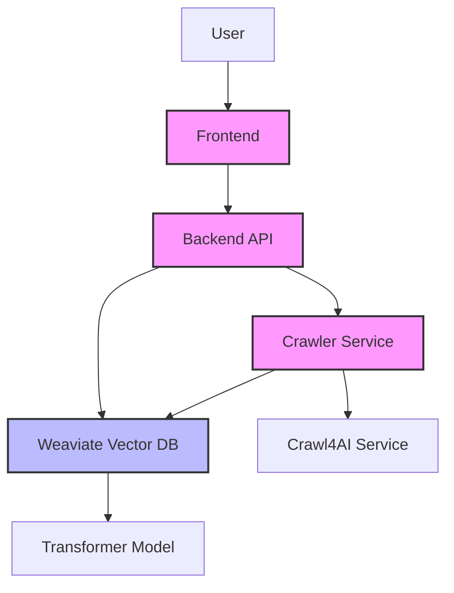
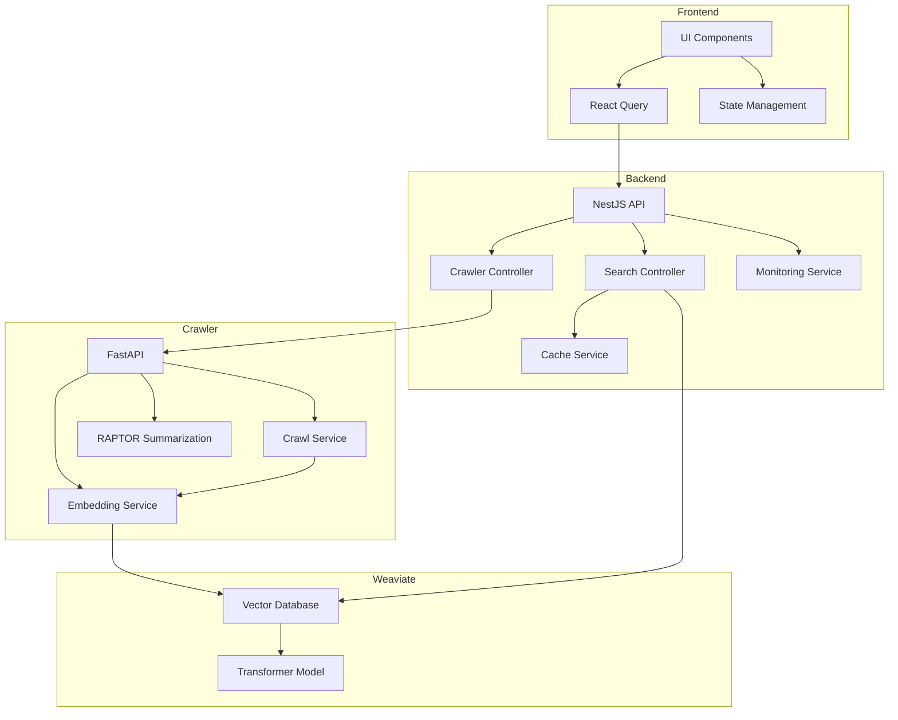

# 🚀 RAPTOR Documentation Assistant

<p align="center">
  
  
  
  
  
</p>

A cloud-based documentation assistant using RAPTOR (Recursive Abstractive Processing and Thematic Organization for Retrieval) and Crawl4AI. Transform large-scale documentation into queryable, context-aware knowledge.

## 📖 Overview

RAPTOR Documentation Assistant transforms technical documentation into queryable embeddings for efficient and context-aware programming solutions. It combines advanced crawling capabilities with hierarchical AI-driven summarization to provide precise, up-to-date answers to technical queries.

## 🏗 Architecture



The system consists of three microservices:

### 1. 🐍 Crawler Service (Python/FastAPI)

Responsible for fetching and processing documentation:

- **Web Crawling**: Integration with Crawl4AI for efficient web scraping
- **Text Processing**: Extracts key information from HTML
- **Summarization**: RAPTOR-based hierarchical summarization
- **Vector Embedding**: Generates embeddings for vector search

**Key Technologies:**
- FastAPI framework
- Python 3.12
- Asyncio for concurrent processing
- Pydantic for data validation
- Weaviate client for vector storage

### 2. 🖥️ Backend Service (NestJS)

Provides an API layer for the frontend:

- **Search API**: Vector similarity search via Weaviate
- **Crawl Management**: Coordinates crawling operations
- **Caching**: Optimizes frequent queries
- **Monitoring**: Tracks API performance

**Key Technologies:**
- NestJS framework
- TypeScript
- Weaviate client for vector queries
- Class-validator for DTO validation
- Cache Manager for response caching

### 3. 🌐 Frontend (Next.js)

The user interface for interacting with the system:

- **Search Interface**: Query documentation and view results
- **Crawl Management**: Start and monitor crawl jobs
- **Result Visualization**: Display relevant documents with context

**Key Technologies:**
- Next.js 14
- React 18
- TypeScript
- Tailwind CSS
- React Query
- Zustand state management

## 🛠 Technology Stack

### Core Technologies

| Component | Technologies |
|-----------|--------------|
| **Backend** | NestJS, TypeScript, Axios, Cache Manager |
| **Frontend** | Next.js, React, TanStack Query, Tailwind CSS |
| **Crawler** | Python 3.12, FastAPI, HTTPX, BeautifulSoup4 |
| **Vector Store** | Weaviate, Transformer Models |
| **Infrastructure** | Docker, Docker Compose |
| **Testing** | Jest, Pytest, Supertest |

### Architecture Diagram



## 🚦 Getting Started

### Prerequisites

- Node.js >= 20
- Python >= 3.12
- Docker & Docker Compose
- pnpm (for Node.js package management)
- Poetry (for Python package management)

### Quick Start with Docker

The fastest way to get started is using Docker Compose:

```bash
# Clone the repository
git clone [repository-url]
cd raptor-docu

# Start all services with Docker Compose
docker-compose up -d
```

This will start the entire stack:
- Frontend: http://localhost:8000
- Backend API & Swagger: http://localhost:3000/api
- Crawler API & Swagger: http://localhost:8080/docs
- Weaviate: http://localhost:8081

### Manual Setup

#### 1. Backend (NestJS)

```bash
cd backend
pnpm install
cp .env.example .env  # Configure environment variables
pnpm run dev  # Starts on http://localhost:3000
```

#### 2. Frontend (Next.js)

```bash
cd frontend
pnpm install
cp .env.example .env  # Configure environment variables
pnpm run dev  # Starts on http://localhost:8000
```

#### 3. Crawler Service (Python/FastAPI)

```bash
cd crawler
poetry install
cp .env.example .env  # Configure environment variables
poetry run python -m src.app  # Starts on http://localhost:8080
```

## 🧪 Testing

We follow Test-Driven Development practices with comprehensive test suites:

```bash
# Backend tests
cd backend
pnpm run test        # Unit tests
pnpm run test:e2e    # End-to-end tests

# Frontend tests
cd frontend
pnpm run test        # Component and integration tests

# Crawler tests
cd crawler
poetry run pytest    # Unit and integration tests
```

## 🛠️ CLI Tools

For command-line interaction with the API:

```bash
cd backend/scripts
./raptor-cli.sh help        # Show available commands
./raptor-cli.sh search      # Search documentation
./raptor-cli.sh crawl       # Start a crawl job
./raptor-cli.sh monitoring  # Check API performance
```

## 📚 Documentation

Detailed documentation is available in the `docs/` directory:

- [Project Plan](docs/PROJECT_PLAN.md): Development roadmap and progress
- [API Endpoints](docs/API_ENDPOINTS.md): Complete API reference
- [Changelog](docs/CHANGELOG.md): Version history and updates
- [Architecture](docs/structure/structure.md): Detailed architecture guide

## 🔍 Key Features

- **Recursive Summarization**: Hierarchical document understanding
- **Semantic Search**: Context-aware vector search
- **Automated Crawling**: Efficient documentation extraction
- **Performance Monitoring**: Real-time API metrics
- **Caching**: Optimized response times for frequent queries

## 🤝 Contributing

We welcome contributions! Please read our guidelines for details on the process for submitting pull requests.

## 📄 License

This project is licensed under the MIT License - see the [LICENSE](LICENSE) file for details.

## 👥 Team

- Jose Tomas Perez-Acle - Project Lead