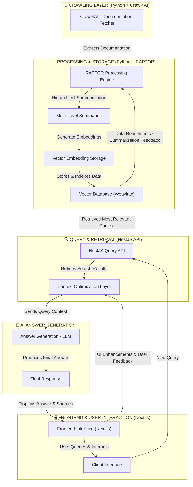

# 📖 Documentation Crawler - RAPTOR & Crawl4AI

## 🏗 Overview

This project aims to develop a **cloud-based documentation crawler** using **RAPTOR (Recursive Abstractive Processing and Thematic Organization for Retrieval)** and **Crawl4AI**. The system will transform large-scale documentation into **embeddings** that can be efficiently queried for up-to-date programming solutions.

## 🚀 Key Objectives
- **Automated Crawling**: Fetch and update documentation using Crawl4AI.
- **Hierarchical Summarization**: Process documents into structured, multi-level summaries.
- **Vector-Based Retrieval**: Store embeddings for **fast** and **contextual** search.
- **Context-Aware Answering**: Use LLMs to generate precise responses from retrieved data.
- **Cloud-Based Architecture**: Scalable infrastructure for **efficient querying**.

---

## 🛠 **Technology Stack**
| Component           | Technology |
|--------------------|------------|
| **Crawling**       | Crawl4AI (Python) |
| **Summarization**  | RAPTOR (Python) |
| **Embedding Storage** | Weaviate (TypeScript) |
| **Backend API**    | NestJS (TypeScript) |
| **Frontend**       | Next.js (TypeScript) |
| **Infrastructure** | Docker, Kubernetes, Terraform (Cloud Deployment) |

---

## 🌍 **System Architecture**
This system consists of **three main services**:
1. **Crawler Service (Python - Crawl4AI)**: Fetches documentation and converts it into structured data.
2. **Processing Engine (Python - RAPTOR)**: Summarizes and embeds data into a vector store.
3. **Query Service (NestJS - TypeScript)**: Serves API requests and retrieves relevant embeddings for user queries.

---

## 🛠 **Workflow Breakdown**
1. **Crawling (Python + Crawl4AI)**
   - Fetches the latest documentation updates.
   - Converts content into structured text and stores it in raw format.

2. **Processing (Python + RAPTOR)**
   - Hierarchically summarizes documents.
   - Generates embeddings for multi-level retrieval.
   - Stores data in **Weaviate** for efficient search.

3. **Querying (NestJS + TypeScript)**
   - Handles search requests from the frontend.
   - Retrieves relevant embeddings and context-aware information.
   - Sends refined data to LLM for **precise answer generation**.

4. **Answer Generation (LLM Integration)**
   - Takes retrieved embeddings and generates human-readable responses.
   - Ensures the final answer **stays relevant** to the original documentation.

5. **Frontend Interface (Next.js)**
   - Provides a clean **UI** for users to search documentation.
   - Displays generated answers and relevant document sources.

---

## 🔥 **Next Steps**
1. **Set up repository structure** ✅
2. **Develop API contracts between Python & TypeScript** ⏳
3. **Implement RAPTOR hierarchical summarization** ⏳
4. **Integrate embedding storage (Weaviate)** ⏳
5. **Build cloud deployment (Docker, Kubernetes)** ⏳
6. **Release MVP & test performance** ⏳

---

## 🎯 **Final Goal**
A **fully autonomous documentation assistant** capable of:
- Fetching **real-time documentation updates**.
- Structuring large documents into **efficient, multi-level retrieval units**.
- Providing **fast, context-aware, AI-generated answers** to queries.
- Delivering a **scalable cloud-based solution** for developers.

---

### 🔹 **Author**: Jose Tomas Perez-Acle  
📅 **Date**: February 2025  
📌 **Version**: Initial Plan  
