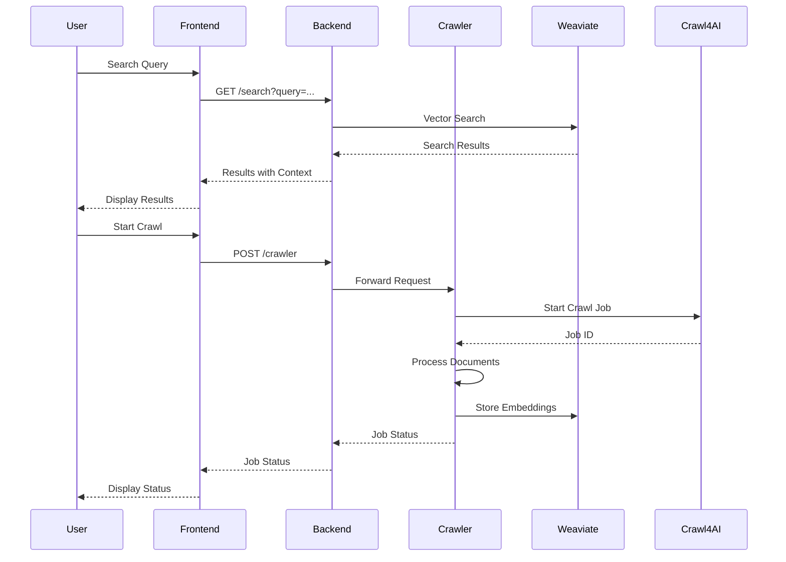
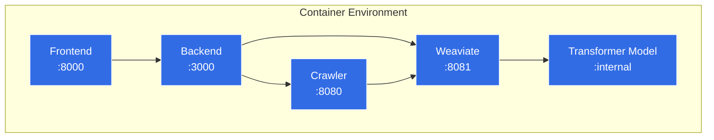

# RAPTOR Documentation Assistant Architecture

This document provides a detailed overview of the RAPTOR Documentation Assistant project structure and architecture.

## Project Structure

```
raptor-docu/
│── backend/                     # TypeScript Backend (NestJS)
│   ├── src/
│   │   ├── app.module.ts        # Root application module
│   │   ├── main.ts              # Application entry point
│   │   ├── crawler/             # Crawler service integration
│   │   │   ├── controllers/     # API controllers for crawling
│   │   │   ├── service/         # Crawler service logic
│   │   │   ├── dto/             # Data transfer objects
│   │   │   ├── interfaces/      # TypeScript interfaces
│   │   │   ├── crawler.module.ts # Module definition
│   │   │   ├── test/            # Unit tests for crawler module
│   │   ├── weaviate/            # Vector database integration
│   │   │   ├── controllers/     # Search API controllers
│   │   │   ├── service/         # Weaviate client services
│   │   │   ├── dto/             # Data transfer objects
│   │   │   ├── models/          # Document models
│   │   │   ├── weaviate.module.ts # Module definition
│   │   │   ├── test/            # Unit tests for weaviate module
│   │   ├── monitoring/          # Performance monitoring
│   │   │   ├── monitoring.controller.ts # Metrics endpoint
│   │   │   ├── monitoring.service.ts    # Metrics collection
│   │   │   ├── performance.interceptor.ts # Request timing
│   │   │   ├── dto/             # Response DTOs
│   │   │   ├── monitoring.module.ts # Module definition
│   ├── test/                    # e2e tests
│   │   ├── crawler/             # Crawler e2e tests
│   │   ├── weaviate/            # Search e2e tests
│   ├── scripts/                 # Utility scripts
│   │   ├── raptor-cli.sh        # Command-line interface
│   ├── Dockerfile.dev           # Development container config
│   ├── package.json             # Dependencies
│   ├── tsconfig.json            # TypeScript configuration
│   ├── .env.example             # Environment variable template
│
│── frontend/                    # Next.js Frontend
│   ├── app/                     # Next.js App Router
│   │   ├── page.tsx             # Home page
│   │   ├── layout.tsx           # Root layout
│   │   ├── search/              # Search functionality
│   │   ├── crawler/             # Crawler management UI
│   │   ├── test/                # API testing page
│   ├── components/              # Reusable UI components
│   │   ├── ui/                  # Basic UI elements
│   │   ├── search/              # Search-specific components
│   │   ├── layout/              # Layout components
│   ├── lib/                     # Utilities and hooks
│   │   ├── api/                 # API client
│   │   ├── store/               # Zustand state management
│   │   ├── utils/               # Helper functions
│   ├── public/                  # Static assets
│   ├── Dockerfile.dev           # Development container config
│   ├── package.json             # Dependencies
│   ├── tailwind.config.ts       # Tailwind CSS configuration
│   ├── tsconfig.json            # TypeScript configuration
│
│── crawler/                     # Python FastAPI Service
│   ├── src/
│   │   ├── app.py               # FastAPI application
│   │   ├── api/                 # API endpoints
│   │   │   ├── v1/              # API version 1
│   │   │   │   ├── router.py    # API router
│   │   │   │   ├── routes/      # Route handlers
│   │   │   │   │   ├── crawl.py # Crawling endpoints
│   │   │   │   │   ├── embedding.py # Embedding endpoints
│   │   │   │   │   ├── summary.py # Summarization endpoints
│   │   ├── crawl4ai/            # Crawl4AI integration
│   │   │   ├── client.py        # HTTP client for Crawl4AI
│   │   │   ├── service.py       # Document processing service
│   │   ├── embedding/           # Vector embedding
│   │   │   ├── service.py       # Embedding generation
│   │   │   ├── weaviate.py      # Weaviate client
│   │   ├── summarization/       # RAPTOR summarization
│   │   │   ├── raptor.py        # Core RAPTOR algorithm
│   │   │   ├── service.py       # Summarization service
│   │   ├── utils/               # Utilities
│   │   │   ├── config.py        # Configuration management
│   ├── data/                    # Data storage
│   │   ├── summaries/           # Generated summaries
│   ├── tests/                   # Pytest test suite
│   │   ├── api/                 # API tests
│   │   ├── crawl4ai/            # Crawl4AI service tests
│   │   ├── embedding/           # Embedding tests
│   │   ├── summarization/       # RAPTOR tests
│   │   ├── conftest.py          # Test fixtures
│   ├── Dockerfile.dev           # Development container config
│   ├── pyproject.toml           # Poetry dependencies
│   ├── poetry.lock              # Locked dependencies
│
│── docker-compose.yml           # Multi-container orchestration
│
│── docs/                        # Documentation
│   ├── CHANGELOG.md             # Version history
│   ├── PROJECT_PLAN.md          # Development roadmap
│   ├── API_ENDPOINTS.md         # API reference
│   ├── structure/               # Architecture documentation
│   │   ├── structure.md         # This file
│
│── CLAUDE.md                    # Development guidelines
│── README.md                    # Project overview
```

## System Architecture

RAPTOR Documentation Assistant follows a microservices architecture with three primary services:

### 1. Crawler Service (Python/FastAPI)

The crawler service is responsible for:
- Fetching documentation using Crawl4AI
- Processing and structuring content
- Generating vector embeddings
- Creating hierarchical summaries with RAPTOR
- Storing data in Weaviate

**Key Components:**
- FastAPI application
- Crawl4AI client for web crawling
- Weaviate client for vector storage
- RAPTOR summarization engine

### 2. Backend Service (NestJS)

The backend service provides:
- REST API for the frontend
- Search functionality via Weaviate
- Crawl job management
- Performance monitoring
- Caching for frequently accessed data

**Key Components:**
- NestJS modules for different functionality areas
- Controllers for API endpoints
- Services for business logic
- DTOs for data validation
- Interceptors for request timing

### 3. Frontend (Next.js)

The frontend provides:
- User interface for searching documentation
- Crawl job management UI
- Result visualization
- Modern, responsive design

**Key Components:**
- Next.js app router structure
- React components for UI
- Zustand for state management
- TanStack Query for data fetching

## Data Flow



## Environment Configuration

Each service has its own environment configuration:

1. **Backend**: `.env` file with:
   - `PORT`: API port (default: 3000)
   - `WEAVIATE_URL`: URL for Weaviate vector database
   - `CRAWLER_API_URL`: URL for Python crawler service

2. **Frontend**: `.env` file with:
   - `NEXT_PUBLIC_API_URL`: URL for backend API
   - `NEXT_PUBLIC_ENVIRONMENT`: Environment name

3. **Crawler**: `.env` file with:
   - `CRAWL4AI_API_KEY`: API key for Crawl4AI service
   - `WEAVIATE_URL`: URL for Weaviate vector database
   - `OPENAI_API_KEY`: For RAPTOR summarization (if using OpenAI)

## Development Workflow

The project follows Test-Driven Development practices:

1. Write tests for new functionality
2. Implement the feature
3. Verify tests pass
4. Update documentation
5. Submit changes

## Container Architecture



The containers are orchestrated using Docker Compose, with health checks ensuring all services are properly started and connected.